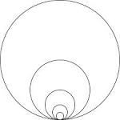

# Parallel

## What Is It?

This package provides OpenMP like syntax for Go.

## For

The function `parallel.For` mimics the `for` structure, but the loop
body is executed in parallel.  For example, the following code snippet
fills slice `m` by numbers `{1,0,3,0}`.

    m := make([]int, 4)
    for i := 0; i < 4; i += 2 {
        m[i] = i+1
    }

The following snippet does the same thing, but in parallel:

    parallel.For(0, 4, 2, func(i int) { m[i] = i+1 })

## Do

The function `parallel.Do` accepts a variable number of parameters,
each should be a function with no parameter nor return value.  It
executes these functions in parallel.  For example, the following code
snippet

    m := make([]int, 4)
    Do(
        func() { m[0] = 0 },
        func() { m[1] = 1 },
        func() { m[2] = 2 },
        func() { m[3] = 3 })

fills `m` by `{0,1,2,3}`.
